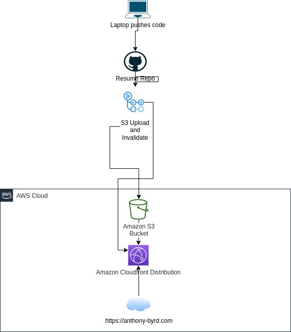

# Diagram of Design

# Design Explanation
1. Workstation pushes code to GitHub
2. GH Action runs that uploads content of repository to static S3 bucket website
3. Cloudfront cache is invalidated so it can serve updated content to Route 53 registered domain

# Additional Features

## Javascript Counter
At the bottom of the page is an atomic counter made with HTML and Javascript. The Javascript code gets an element on the HTML document and increments the count in the DynamoDB database and then displays that count on page load. 

